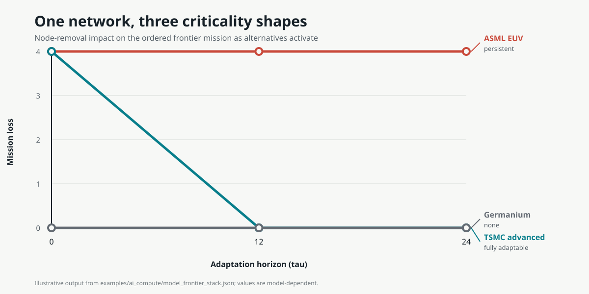

# Criticality Spectrometer

**Find single points of failure, measure their mission-level blast radius, and
see which risks a fast-enough substitute or failover can retire.**

[](https://github.com/AMBRA7592/criticality-spectrometer/actions/workflows/ci.yml)
[](https://pypi.org/project/criticality-spectrometer/)
[](https://www.python.org/)
[](LICENSE)
[](https://github.com/AMBRA7592/criticality-spectrometer/releases)
[](https://doi.org/10.5281/zenodo.21383918)



Criticality Spectrometer performs fault-tree-style AND/OR dependency analysis
with a time-to-substitute dimension. It is not a probabilistic fault-tree
solver: it does not estimate failure rates, MTBF, or minimal cut sets. Instead,
it removes each modeled component, sweeps the time at which substitutes become
available, and records mission loss at every horizon. The result distinguishes
a component that remains a single point of failure from one whose risk can be
retired by enabling an alternative soon enough.

Use it to ask:

- Which components are single points of failure for the mission I modeled?
- What is each component's mission-level blast radius?
- Does apparent redundancy preserve the required capability, or only a path?
- Would a substitute or failover available by a given horizon restore the mission?
- Which failed requirements and downstream casualties produce the measured curve?

## Install

```bash
pip install criticality-spectrometer
```

That puts the `criticality-spectrometer` command and the Python API on your
system. From v0.1.2, the demo fixtures are also bundled with the package, so
the 60-second demo needs no clone:

```bash
criticality-spectrometer example canonical --output model.json
criticality-spectrometer run model.json
```

The full worked examples, tests, and tutorial ship with the source; clone the
repository to explore those:

```bash
git clone https://github.com/AMBRA7592/criticality-spectrometer.git
cd criticality-spectrometer
```

## Run it in 60 seconds

```bash
criticality-spectrometer run examples/canonical/model.json
```

The canonical model is a seven-node, hand-verifiable fixture. Its bottleneck has impact `1` at `tau=0` and `0` after its backup activates at `tau=12`:

```text
node                     impact               shape                OR gap
bottleneck               [1, 0, 0]            fully_adaptable      [1, 0, 0]
```

Use JSON output for a reproducible artifact:

```bash
criticality-spectrometer run examples/canonical/model.json --format json > result.json
```

JSON reports identify the instrument and schema versions, model SHA-256,
horizons, and run configuration. The contract is
[`schema/result.schema.json`](schema/result.schema.json).

Prefer the Python API?

```python
from criticality_spectrometer import load_model, run_sweep

model = load_model("examples/tutorial/model.json")
result = run_sweep(model)
print(result.curves["runner_primary"].impact)
# [1, 0]
```

The narrated [model-your-first-system tutorial](docs/tutorial.md) builds that
ten-node CI pipeline from scratch.

CLI exit codes are stable: `0` means success, `2` means invalid CLI input or an
invalid model, and `3` means the model failed the positive, constant-baseline
requirement. `criticality-spectrometer --version` prints the installed version.

## Explain a curve

`run` tells you *what* a node's curve is; `explain` shows *why* — per horizon:
lost and restored sinks, casualties grouped by cascade round, every unsatisfied
requirement group, and which substitutes are active versus actually rescuing a
group. Rounds are propagation stages, not unique-causality claims.

```bash
criticality-spectrometer explain examples/canonical/model.json bottleneck
```

```text
tau=0   impact 1   lost sinks: sink
  round 1: assembler — unsatisfied: stage_bottleneck (members: bottleneck; pending: backup@12)
  round 2: sink — unsatisfied: final (members: assembler)
  ...
tau=12   impact 0   lost sinks: none   restored: sink
  rescuing substitutes: backup -> assembler.stage_bottleneck @12
```

`--format json` emits a self-identifying document conforming to
[`schema/explain.schema.json`](schema/explain.schema.json).

## What the instrument returns

For every node, the sweep reports an impact curve and a conservative shape class:

| shape | curve behavior | interpretation |
|---|---|---|
| `persistent` | positive and unchanged | alternatives do not reduce measured loss |
| `fully_adaptable` | falls to zero | available alternatives eventually restore the mission |
| `partially_adaptable` | declines but stays positive | adaptation helps without eliminating loss |
| `none` | zero at every horizon | removal does not reduce the selected mission outcome |

These labels describe model output. They are not policy recommendations or empirical claims by themselves.

## Model contract

A model contains:

- nodes;
- identified requirement groups with `AND` or `OR` logic;
- substitutes targeted to a specific requirement group and activation time;
- one mission outcome: `served_sinks` or `ordered_served_sinks`.

The machine-readable contract is in [`schema/model.schema.json`](schema/model.schema.json). The formal cascade, outcome, baseline, and comparison semantics are in [`docs/method.md`](docs/method.md).

## Worked example: AI compute supply chain

The repository includes a 52-node worked example expressed entirely as model data; the engine contains no semiconductor-specific entities. Three missions separate topology, an advanced-fab path, and the primary ordered frontier stack.

The primary stack reproduces the prior case study's seven named acceptance tests at the shape level. For example, the modeled EUV corridor is persistent, TSMC is fully adaptable over the specified horizons, and germanium has no impact on that mission. The example is an application, not cross-domain validation.

- [Parity analysis and divergences](examples/ai_compute/PARITY.md)
- [Evidence ledger](examples/ai_compute/evidence_ledger.json)
- [Frozen source manifest](examples/ai_compute/v2_5_manifest.json)
- [Non-claims and empirical boundaries](docs/nonclaims.md)

Rebuild and verify the example:

```bash
python examples/ai_compute/build_ai_case.py
pytest -q tests/test_ai_case.py
```

## Worked example: Kubernetes Bookinfo

The second domain compares endpoint redundancy declared by an Istio Bookinfo
Kubernetes Service with the route observed for one bounded request. In the
selector view, `reviews_v1` is non-critical because three versions are eligible;
in the observed all-v1 route view, its curve is `[1, 0]` because a modeled route
change to the already-deployed v2 restores the mission after five minutes.

The example preserves pinned manifest/source inventory and the normalized
request record separately, labels the five-minute adaptation time as an
assumption, and uses `explain` to expose four failure rounds and the restoring
substitute. Those rounds preserve the declared `productpage` Service layer.

- [Bookinfo result and non-claims](examples/kubernetes/README.md)
- [Evidence ledger](examples/kubernetes/evidence_ledger.json)
- [Declared selector model](examples/kubernetes/model_declared.json)
- [Observed route model](examples/kubernetes/model.json)

Rebuild and verify it:

```bash
python examples/kubernetes/build_bookinfo_case.py
pytest -q tests/test_kubernetes_case.py
```

## How it differs from common network measures

| method | represents | answer type |
|---|---|---|
| Centrality | position in a graph | scalar score |
| Critical-node detection | disconnection caused by removal | scalar or set |
| **Criticality Spectrometer** | mission loss across adaptation horizons under explicit requirements | **curve and shape class** |

## Scope

This is an alpha research instrument with a canonical fixture and two bounded
worked domains. It does not infer dependencies, estimate activation times,
prove causal claims, or turn shape classes into policy prescriptions. The
current model contract also lacks connectivity-only edges; the AI example logs
where that boundary matters. The Kubernetes example uses one externally
reported request and is an external-validity probe, not broad validation.

See [`docs/nonclaims.md`](docs/nonclaims.md) for the full boundary and [`CHANGELOG.md`](CHANGELOG.md) for release history.

## Development

```bash
python -m pip install -e ".[test]"
pytest -q
```

Contributions are welcome, especially independent examples that exercise the frozen model contract without adding domain logic to the engine. See [`CONTRIBUTING.md`](CONTRIBUTING.md).

## Citation and license

Citation metadata is provided in [`CITATION.cff`](CITATION.cff). Released under the [MIT License](LICENSE).
