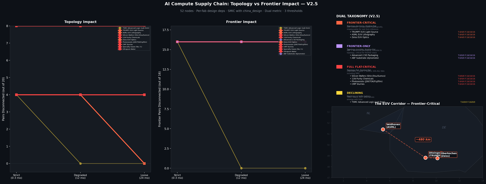

# Topology and frontier capability are not the same thing

**A dual-metric substitutability curve analysis of the AI compute supply chain.**

The AI compute supply chain — 52 nodes, 13 countries, over $650 billion in annual hyperscaler capex — appears richly redundant. A graph analysis with AND-dependency cascades and two impact metrics reveals that topological redundancy and frontier inference capability diverge: nodes exist that are topologically compensable but frontier-irreplaceable.

Four categories emerge from the dual taxonomy:

**Frontier-critical** (topology-declining, frontier-flat) — three companies whose topological impact declines at the 24-month horizon (SMIC provides alternative routes) but whose frontier-stack impact is invariant (no sub-5nm alternative exists):
- ASML (Veldhoven, NL) — sole source of EUV lithography
- Zeiss SMT (Oberkochen, DE) — sole source of EUV optics
- TRUMPF (Ditzingen, DE) — sole source of EUV high-power light sources

**Frontier-only** (topology-invisible, frontier-flat) — nodes with zero topology impact but 16/16 frontier-stack impact, surfaced only by the ordered end-to-end stack metric:
- ABF Substrate (Ajinomoto, ~95% market share)
- Advanced 2.5D Packaging

**Full flat-critical** (topology-flat, frontier-flat) — material classes whose removal disables all fabs including SMIC:
- Photoresists, CMP slurries, specialty gases, purity chemicals, ultrapure water, silicon wafers

**Declining** (both metrics decline) — TSMC, cloud providers, server assemblers.



## What's in this repo

```
criticality-spectrometer/
├── README.md
├── LICENSE
├── requirements.txt
└── ai-compute-supply-chain/
    ├── compute_rir_v2_5.py        # Full computation (52 nodes, dual metric, audit block)
    ├── rir_v2_5.json              # Results (topology + frontier-stack + source decomposition)
    ├── euv_corridor_v2_5.png      # Dual-panel chart (topology vs frontier)
    └── euv_corridor_post_v2_5.md  # 1,100-word writeup
```

## Version history

**v2.5** (current) — Silicon wafers added as explicit fab AND-dependency. Frontier redefined as ordered end-to-end stack (source → advanced fab → advanced packaging → server → cloud → sink). ABF substrate and advanced packaging now surface as frontier-flat. Frontier source decomposition added. Sensitivity comparison between fab-only and stack frontier definitions.

**v2.4** — Fab design requirements moved to per-fab AND-deps. Chinese design ecosystem added as explicit SMIC input. Frontier impact metric introduced (fab-only definition). Source impact formula made symmetric.

**v2.3** — Chemical AND-deps split into separate required categories. Sources included in impact scoring. CoWoS AND-deps added. Adversarial code review identified bugs in v2.2 that changed the result from 3 flat-critical nodes to 12.

**v2.3 → v2.5 correction summary:** v2.3 classified ASML/Zeiss/TRUMPF as topology-flat-critical. This was an artifact: SMIC silently failed a blanket design-predecessor check because no design-to-SMIC edge existed. v2.4 corrected this with per-fab design requirements. v2.5 further corrected the frontier metric from fab-touch to ordered stack, and added silicon wafers as a fab prerequisite. The EUV corridor is now correctly classified as topology-declining but frontier-flat.

## Key concepts

**AND-dependencies.** A fab needs photoresists *and* slurries *and* gases *and* chemicals *and* water *and* wafers *and* lithography *and* a chip design simultaneously. ASML needs Zeiss *and* TRUMPF. Advanced packaging needs fab output *and* HBM *and* ABF substrate.

**Substitutability thresholds.** Strict (0–3 months), degraded (12 months), loose (24 months).

**Two metrics.** Topology: source-to-sink reachability (20 pairs). Frontier-stack: ordered path through advanced fab → packaging → server → cloud (16 pairs). The gap between them is the finding.

**Robustness tiers.** Analyst-assigned judgment register, not computed by the algorithm. Tier A (robust single-entity): ASML, Zeiss, TRUMPF, ABF, advanced packaging. Tier C (resolution/threshold/model-sensitive): chemistry categories, raw material sources.

## How to replicate

```bash
pip install -r requirements.txt
python ai-compute-supply-chain/compute_rir_v2_5.py
```

The script prints results, runs acceptance tests, and generates chart + JSON. The computation is deterministic.

## How to challenge

The edge list (lines 190–360 of `compute_rir_v2_5.py`) encodes every analytical judgment.

**Move a threshold.** Shift design→Samsung/Intel from degraded to loose. TSMC re-enters frontier-flat.

**Split a category.** Decompose photoresists into JSR/TOK/Shin-Etsu/Fujifilm. The category likely shifts from flat to declining.

**Add AND-deps.** Server integration arguably needs chips AND memory AND networking AND power. Add these and re-run.

**Add HPQ alternatives.** Model degraded quartz edges from Russia/Brazil/China. Test whether HPQ stays flat.

## Model scope and known exclusions

This is a structural framework, not an empirical digital twin. Known exclusions:

- AND-dependencies cover fabs, ASML, and advanced packaging only. Server, networking, power/thermal, and cloud layers use OR-semantics.
- Category nodes aggregate multiple suppliers. Splitting to supplier level would likely convert several from flat to declining.
- HPQ lacks degraded alternative-quartz edges. Its topology-flat status is model-dependent.
- Temporal buffers (installed base, inventory) are not modeled. The finding applies to new capacity, not existing fleet.
- The frontier-stack metric requires an ordered path through advanced packaging. It is a more realistic proxy than fab-only reachability but is not a complete end-to-end capability model.

## Prior art

- Arulselvan et al. 2009 — Critical Node Detection Problem
- Snyder et al. 2016 — OR/MS models for supply chain disruptions
- UVA NSDPI 2025 — Microelectronics supply chain lock-in and substitutability

The dual topology/frontier taxonomy and ordered-stack frontier definition are, to our knowledge, novel contributions.

## Author

Amadeus Brandes · Independent researcher · Kronberg, Germany

## License

MIT. Use it, extend it, challenge it.
